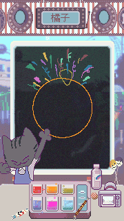

# Blow Something

🕹️ **[游玩 | Play](https://blow.ayu.land)**

用泡泡作画的“你画我猜”小游戏。玩家拖动并戳破肥皂泡绘制图案，赛博猫咪则尝试读懂这幅灵魂画作。三个泡泡要怎样才能描绘出万千世界？我们相信每位玩家都会有自己的灵感。泡泡总是让我们想到回忆里的童年；在这里，我们尝试用像素画风重现千禧年温暖的午后一角。

A draw-and-guess game with bubbles as the paintbrush. The player drags and pops the soap bubbles to paint, while the cyber kitten attempts to figure out these bubbly doodles. How can just three bubbles capture the vastness of the world? We believe that every player will find inspirations of their own. Bubbles always remind us of our past childhood memories; here, we try to recreate a slice of a mellow afternoon from the 2000s in pixel art.

Global Game Jam 2025 参赛作品 / Entry to Global Jam 2025  
主题：泡泡 *Bubbles* / Theme: *Bubbles*  
Ayu, Jupiter, Suan, Avery

## 许可 / Permit

程序源码以 GNU Affero 通用公共许可证（AGPL v3）分发，其余资源以知识共享署名—非商业性使用—相同方式共享许可证（CC BY-NC-SA 4.0）分发。

All source code is distributed under the GNU Affero General Public License (AGPL v3). Remaining assets distributed under the Creative Commons Attribution-NonCommercial-ShareAlike license (CC BY-NC-SA 4.0).
